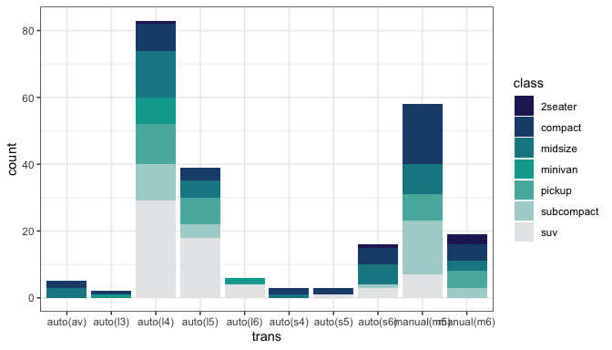
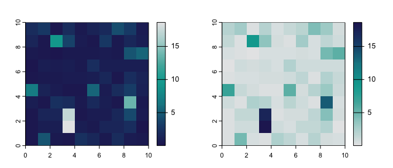
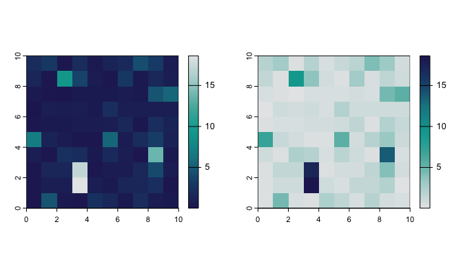
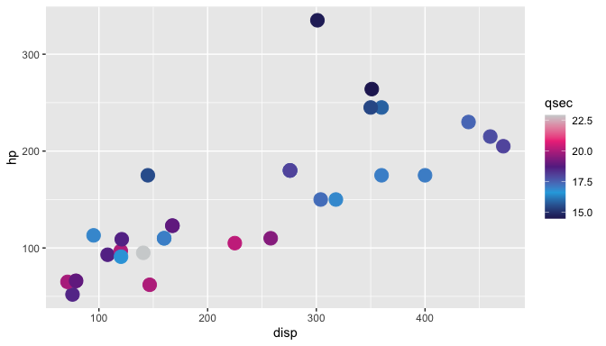

<!-- README.md is generated from README.Rmd. Please edit that file -->

# idpalette

Palettes based on the colour schemes for
[IDEM](https://www.telethonkids.org.au/our-research/brain-and-behaviour/child-health-analytics-research-program/infectious-disease-ecology-and-modelling/),
[IDDU](https://mspgh.unimelb.edu.au/research-groups/centre-for-epidemiology-and-biostatistics-research/infectious-disease-dynamics),
and [ACEFA](https://acefa-hubs.github.io)

<!-- badges: start -->

[](https://github.com/idem-lab/idpalette/actions/workflows/R-CMD-check.yaml)
<!-- badges: end -->

## Installation

You can install the development version of `idpalette` from
[GitHub](https://github.com/) with:

``` r
# install.packages("devtools")
devtools::install_github("idem-lab/idpalette")
```

### Python friend

There is a python version of `idpalette` also on
[GotHyb](https://github.com/) by Rob Moss:

<https://github.com/robmoss/idpalette>

## Using `idpalette`

The function `idpalette` takes arguments:

- `p`, the palette, i.e., `"idem"`, `"iddu"`, or `"acefa"`, and
- `n`, number of colours needed.

These can also be accessed by alias functions for each palette:
`idem(n)`, `iddu(n)`, and `acefa(n)`

If `n` is not specified, the default is the number of colours in the
true base palette, i.e., 7 for IDEM, and 5 for IDDU and ACEFA.

Usage per above calls palettes based on the colours in the group logos.
There are also “official” versions of the palettes, which contain only
the four colours specifically selected for use by the graphic design
team.

## Main colours

### IDEM

``` r
library(idpalette)
idpalette("idem")
```


``` r
idpalette("idem_official")
```


### IDDU

``` r
idpalette("iddu")
```


``` r
idpalette("iddu_official")
```


### ACEFA

``` r
idpalette("acefa")
```


``` r
idpalette("acefa_official")
```


## Alias functions

``` r
idem()
```


``` r
iddu()
```


``` r
acefa()
```


## Your colours your way

As many or as few colours as you want, forwards or backwards.

``` r
idpalette("iddu", 20)
```


``` r
idpalette("acefa", 2)
```


``` r
idem(10, rev = TRUE)
```


## Have a go ya mug

``` r
library(ggplot2)

ggplot(
  faithfuld,
   aes(waiting, eruptions)
) +
 geom_raster(
   aes(fill = density)
 ) +
  scale_fill_gradientn(
    colours = idpalette("iddu", 100)
  )
```



``` r
ggplot(mpg) +
  geom_bar(
    aes(
      x = trans,
      fill = class
    )
  ) +
  scale_fill_manual(values = idpalette("idem")) +
  theme_bw()
```



Works with `terra` plotting:

``` r
library(sdmtools)
library(terra)
#> terra 1.7.78
```

``` r

r <- example_raster(seed = 20240802)

par(mfcol = c(1, 2))

plot(
  r,
  col = idem(100)
)

plot(
  r,
  col = idem(100, rev = TRUE)
)
```



Sometimes `ggplot2` won’t play nicely being fed a vector of values for
continuous scales, so `scale_id_continuous` allows `idpalette` or any
arbitrary vector of colours to be used:

``` r
library(ggplot2)

ggplot(mtcars) +
 geom_point(
   aes(
     x = disp,
     y = hp,
     colour = qsec
   ),
   size = 5
 ) +
 scale_id_continuous(
   cols = iddu(),
   aesthetics = "colour"
 )
```


