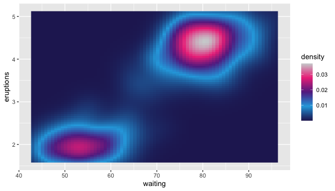
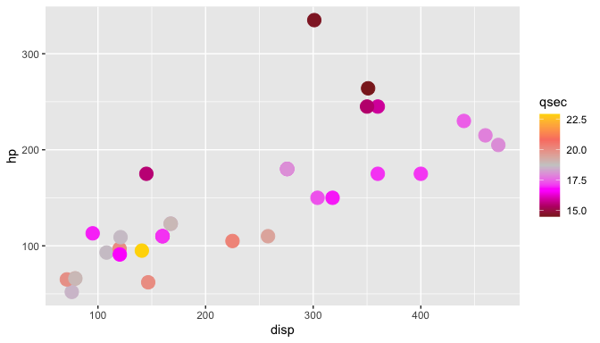
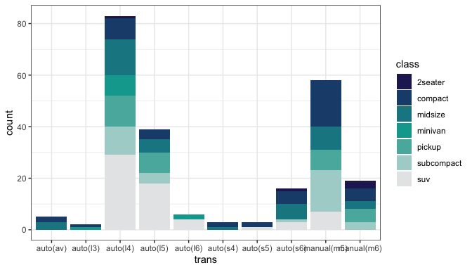
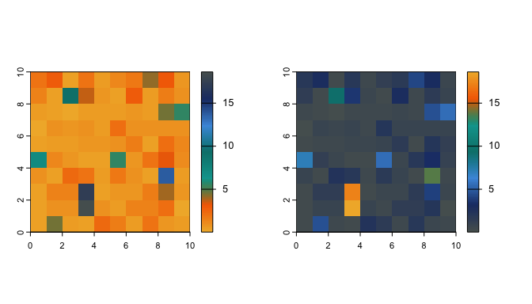

<!-- README.md is generated from README.Rmd. Please edit that file -->

# idpalette

Palettes based on the colour schemes for
[IDEM](https://www.thekids.org.au/our-research/infectious-diseases/infectious-disease-ecology-and-modelling/),
[IDDU](https://mspgh.unimelb.edu.au/research-groups/centre-for-epidemiology-and-biostatistics-research/infectious-disease-dynamics),
[ACEFA](https://acefa-hubs.github.io), and [The Kids Research Institute
Australia](https://www.thekids.org.au/)

<!-- badges: start -->

[](https://github.com/idem-lab/idpalette/actions/workflows/R-CMD-check.yaml)
[](https://app.codecov.io/gh/idem-lab/idpalette)
<!-- badges: end -->

## `idpalette` does two things

- provides functions for colour palettes based on IDEM, IDDU, ACEFA, and
  The Kids, and
- provides a `scale` function that allows the use of these or any color
  palette with `ggplot2` continuous scales.

### Palettes

For a palette of `n` colours, call: `idem(n)`,`iddu(n)`, `acefa(n)`, or
`thekids(n)`

A wider range of slightly differing palettes available via `idpalette`,
see `?idpal` for details.

### `ggplot2` scale

`ggplot2` does not like it when you specify an arbitrary vector of
colours to a continuous scale. `scale_id_continous` allows you to pass
any vector of colours, either as an `idpalette` palette, another
palette, or a character vector of whatever god-awful unicorn vomitus
suits your whimsy of the moment.

## Installation

You can install the development version of `idpalette` from
[GitHub](https://github.com/) with:

``` r
# install.packages("devtools")
devtools::install_github("idem-lab/idpalette")
```

#### Python friend

Python version of `idpalette` by Rob Moss:
<https://github.com/robmoss/idpalette>

## Palettes

### IDEM

``` r
library(idpalette)
idem()  # alias for idpalette("idem")
```


``` r
idpalette("idem_official")
```


### IDDU

``` r
iddu()  # alias for idpalette("iddu")
```


``` r
idpalette("iddu_official")
```


### ACEFA

``` r
acefa() # alias for idpalette("acefa")
```


``` r
idpalette("acefa_official")
```


### The Kids

``` r
thekids() # alias for idpalette("thekids")
```


``` r
idpalette("thekids_official")
```


``` r
idpalette("thekids_diverging")
```


## Your colours your way

As many or as few colours as you want, forwards or backwards.

``` r
idpalette("iddu", 20)
```


``` r
idpalette("acefa", 2)
```


``` r
idem(10, rev = TRUE)
```


## Deal with `ggplot2`’s objections.

Sometimes `ggplot2` won’t play nicely being fed a vector of values for
vector of colours to be used in continuous scales.

`scale_id_continuous` allows `idpalette` or any arbitrary vector of
colours to be converted into a continuous palette:

``` r
library(ggplot2)

ggplot(mtcars) +
 geom_point(
   aes(
     x = disp,
     y = hp,
     colour = qsec
   ),
   size = 5
 ) +
 # usual approach to alter colours:
 # scale_fill_continuous(
 #   palette = iddu()
 # ) # but not allowed: Cannot convert `x` to a continuous palette.
 # instead we use `scale_id_continuous`:
 scale_id_continuous(
   cols = iddu(),
   aesthetics = "colour"
 )
```



With your own wonderful colour scheme

``` r
my_wonderful_colour_scheme <- c("brown4", "magenta", "grey80", "salmon", "gold")

ggplot(mtcars) +
 geom_point(
   aes(
     x = disp,
     y = hp,
     colour = qsec
   ),
   size = 5
 ) +
 scale_id_continuous(
   cols = my_wonderful_colour_scheme,
   aesthetics = "colour"
 )
```



## Have a go ya mug

``` r
library(ggplot2)

ggplot(
  faithfuld,
   aes(waiting, eruptions)
) +
 geom_raster(
   aes(fill = density)
 ) +
  scale_fill_gradientn(
    colours = idpalette("iddu", 100)
  )
```


``` r
ggplot(mpg) +
  geom_bar(
    aes(
      x = trans,
      fill = class
    )
  ) +
  scale_fill_manual(values = idem()) +
  theme_bw()
```



With `terra`:

``` r
library(sdmtools)
library(terra)
#> terra 1.8.60

r <- example_raster(seed = 20240802)

par(mfcol = c(1, 2))

plot(
  r,
  col = thekids(100)
)

plot(
  r,
  col = thekids(100, rev = TRUE)
)
```


